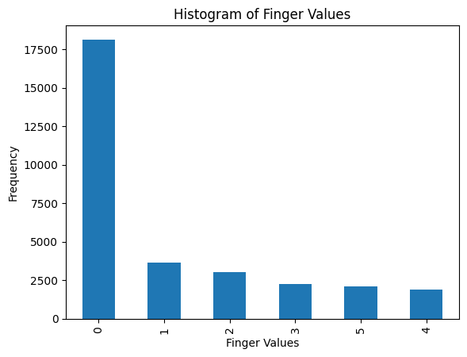
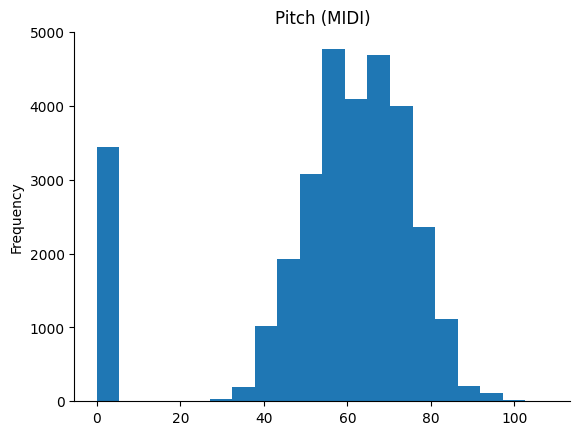

# Piano Fingering


## Abstract

This project leverages machine learning to predict piano fingering for musical scores. It uses real-world annotated piano scores, processes them to extract meaningful features, trains a Random Forest model, and applies the model to annotate unseen scores with predicted fingering.


## Problem Overview

Determining optimal piano fingering for a given score is a challenging task, influenced by musical, physiological, and stylistic factors. Current solutions rely on manual annotation, which can be time-consuming and inconsistent. This project automates fingering prediction using machine learning techniques, making it a valuable tool for learners, educators, and composers.


## Project Overview

The project consists of three main components

### Training Data Preparation

Parsed publicly available MusicXML files with fingering annotations using the music21 library. Extracted features such as note pitch, chord information. Combined extracted data into a structured CSV dataset (piano_fingering.csv) for training.

### Model Training and Evaluation

Engineered features for the Random Forest model (previous fingering data). Trained a Random Forest Classifier and evaluated its performance using accuracy and confusion matrices. Saved the trained model for future use.

### Application

Created a script to apply the trained model to new scores, annotating them with predicted fingering.


## Dependencies and Setup

The following tools and libraries were used in the project:

**MuseScore**: A free, open-source music notation program that includes features for creating and editing scores.

**music21**: An object-oriented toolkit for analyzing, searching, and transforming music in symbolic (score- based) forms.

**MuseScore.com:** A website that allows users to share, save, and publish sheet music online.

**MusicXML:** is a format for sharing digital sheet music between applications. It's an open, flexible, and human-readable format that uses XML to represent musical elements. 


### Installation

```shell
# Install MuseScore
sudo add-apt-repository ppa:mscore-ubuntu/mscore3-stable -y
sudo apt-get update
sudo apt-get install musescore3

# Install libraries
pip install music21
pip install musicxml

# Configure Music21
python3 -c "from music21 import configure; configure.run()"
```


## Data Preparation

- Collected piano scores (in MusicXML format) from Musescore.com, focusing on publicly available scores with fingering annotations.

- Processed 32 scores, containing over 31,000 notes, of which 13,000 had fingering annotations.

- Extracted data for each hand (right/left), including notes, chords, rests, and their associated fingerings.

- Stored the processed dataset in `piano_fingering.csv`.





**Details**: See `example_gen.py`.


## Training

### Feature Engineering
 Added additional features that capture previous two notes and their respective fingerings (temporal dependencies).

**Features Used**:

- Hand (left/right)

- Pitch (MIDI number)

- Is part of a chord

- Previous note's pitch and finger

- Previous-previous note's pitch and finger

**Details**: See `train_rf_model.py`.


## Evaluation

Training Accuracy: **95.05%**

Testing Accuracy: **77.71%**

### Feature Importance
The note's MIDI pitch and relative distance to previous two notes are the most improtant features for the model.


### Confusion Matrix

The high values along the diagonal indicate that the model performs well in correctly predicting most fingers. Fingers 1 and 2 have better predictions, and finger 4 is the most difficult to predict (it is also less frequently used in the training dataset). 


## **Fingering Application**

The trained model was applied to new scores to predict fingering. The `fingering_application.py` script iterates over MusicXML files, predicts fingering for each note based on context, and outputs the annotated score.

Example: Twinkle, Twinkle, Little Star (model generated fingering):


## **Future Work**

1. Experiment with alternative models (e.g., Gradient Boosting, SVM, XGBoost).

2. Generate synthetic training data using music theory heuristics.

3. Add forward-looking features, note duration, and rhythmic patterns for improved prediction.


## **Conclusion**

This project demonstrates how machine learning can automate piano fingering prediction. While initial results are promising, further refinement in data and models can make this tool invaluable for music education and composition.


## **Files**

- `example_gen.py`: Script for data preparation.

- `train_rf_model.py`: Script for training and evaluating the Random Forest model.

- `fingering_application.py`: Script for updating fingering in a score using trained Random Forest model.

- `piano_fingering.csv`: Prepared dataset.

- `rf_model.joblib`: Trained Random Forest model for inference.
