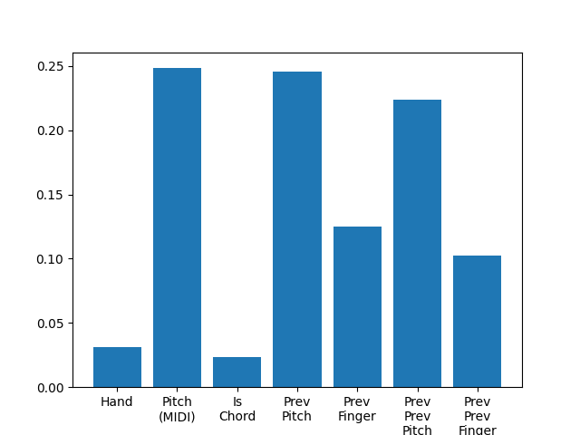
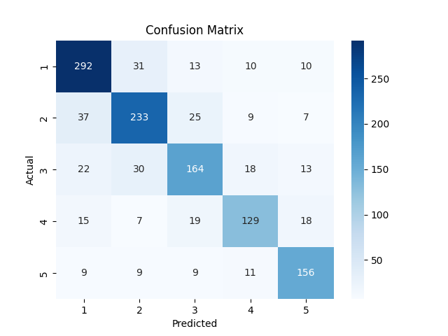

## Files

### Probabilistic Piano Fingering
- 📄 [PDF Report](https://github.com/Anastasia1707/piano-fingering/blob/main/Probabilistic%20Piano%20Fingering%20.pdf)
- 📓 [Google Colab Notebook](https://colab.research.google.com/drive/10XxhJ5FAuUE5TBYMddlNz81ZdxbGJGwP#scrollTo=GOW5yR6KzMgy)

### Random Forest, LSTM, RNN Fingering Models
- 📄 [PDF Report](https://github.com/Anastasia1707/piano-fingering/blob/main/Predicting%20Piano%20Fingering.pdf)
- 📓 [Google Colab Notebook](https://colab.research.google.com/drive/1m4A6lOAbkHcj9SLFnic1hkWiV0W7-ixS#scrollTo=JzTTIEkJ27IQ)

## Abstract

This project leverages machine learning to predict piano fingering for musical scores. It uses real-world annotated piano scores, processes them to extract meaningful features, trains a Random Forest, LSTM, RNN and HMM models and applies them to annotate unseen scores with predicted fingering.

## Problem Overview

Determining optimal piano fingering for a given score is a challenging task. Current solutions rely on manual annotation, which can be time-consuming and inconsistent. This project automates fingering prediction using machine learning techniques, making it a valuable tool for learners, educators, and composers.

## Project Structure

### Training Data Preparation

Parsed publicly available MusicXML files with fingering annotations using the music21 library. Extracted features such as note pitch, chord information. Combined extracted data into a structured CSV dataset (piano_fingering.csv) for training.

### Model Training and Evaluation

Engineered features for the Random Forest, LSTM, RNN. Trained Classifiers and evaluated performance using accuracy and confusion matrices. Saved the trained models for future use.

Applied a generative probabilistic model, the Hidden Markov Model (HMM) using two approaches: one where the HMM parameters are learned directly from the data and another where the model is initialized with priors for transition, emission, and initial state probabilities calculated from the annotated dataset. HMM was chosen because it is naturally suited for sequence labeling tasks like piano fingering. 

### Application

Created a script to apply the trained model to new scores, annotating them with predicted fingering.

## Dependencies and Setup

The following tools and libraries were used in the project:

**MuseScore**: A free, open-source music notation program that includes features for creating and editing scores.

**music21**: An object-oriented toolkit for analyzing, searching, and transforming music in symbolic (score- based) forms.

**MuseScore.com:** A website that allows users to share, save, and publish sheet music online.

**MusicXML:** is a format for sharing digital sheet music between applications. It's an open, flexible, and human-readable format that uses XML to represent musical elements. 

## Data Preparation

- Processed 43 publicly available, fingering-annotated piano scores in MusicXML format from Musescore.com.

●	Total Notes: ~39,000

●	Annotated Notes: ~16,000 (for both hands)

●	Features Extracted: Note pitch (as a MIDI number), chord information, and rest information.

- Extracted data for each hand (right/left), including notes, chords, rests, and their associated fingerings.

- Stored the processed dataset in `piano_fingering.csv`.

## Training

### Feature Engineering
 Added additional features that capture previous notes and their respective fingerings (temporal dependencies).

**Features Used**:

- Hand (left/right)

- Pitch (MIDI number)

- Is part of a chord

- Previous note's pitch and finger

- Previous-previous note's pitch and finger

For HMM Setup:

- Hand Selection: right-hand only as common in fingering prediction research.
- Segmentation: Rests split sequences; single-note phrases discarded.
- Data Split: 80% training (MIDI sequences + lengths), 20% testing (includes ground-truth fingerings).

## Evaluation

Training Accuracy: **95%**

Testing Accuracy: **86%**

### Feature Importance
The note's MIDI pitch and relative distance to previous two notes are the most improtant features for the model.

### Confusion Matrix

The high values along the diagonal indicate that the model performs well in correctly predicting most fingers. Fingers 1 and 2 have better predictions, and finger 4 is the most difficult to predict (it is also less frequently used in the training dataset). 

## **Fingering Application**

The trained model was applied to new scores to predict fingering. The `fingering_application.py` script iterates over MusicXML files, predicts fingering for each note based on context, and outputs the annotated score.

Example: Twinkle, Twinkle, Little Star (model generated fingering):

## **Conclusion**

This project demonstrates how machine learning can automate piano fingering prediction. While initial results are promising, further refinement in data and models can make this tool invaluable for music education and composition.

